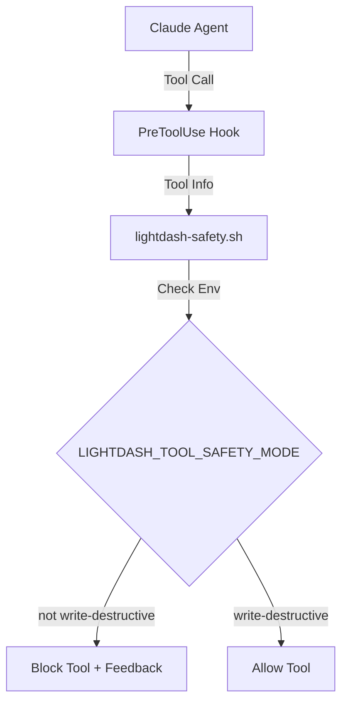

# 5. Deterministic Safety Enforcement for Destructive Tools

Date: 2026-02-13

## Status

Proposed

## Context

While the split plugin architecture ([ADR 0004](0004-split-lightdash-plugin-architecture.md)) provides isolation, we still rely on the LLM to follow system prompts and environment variable constraints for safety. To provide a stronger security guarantee, we need a deterministic blocking mechanism that prevents the execution of destructive tools unless the safety mode is explicitly enabled.

## Decision

We will implement deterministic safety enforcement using Claude Code hooks and a centralized safety script.

### 1. Centralized Safety Script

We will create a shell script `.claude/hooks/lightdash-safety.sh` that:

- Reads the hook input JSON.
- Checks the `LIGHTDASH_TOOL_SAFETY_MODE` environment variable.
- Returns a `permissionDecision: "deny"` if a destructive tool is called and the safety mode is not set to `write-destructive`.
- Provides clear feedback to the agent explaining why the tool was blocked.

### 2. PreToolUse Hook Integration

Each plugin containing destructive tools will register a `PreToolUse` hook in its `hooks.json`.

- **`lightdash-admin`**: Protects `ldt__delete_member`.
- **`lightdash-development`**: Protects `ldt__upsert_chart_as_code`.
- **`lightdash-analysis`**: Implements a strict block on any destructive tools if they happen to be invoked.

### 3. Architecture

## Consequences

- **Positive**:
  - **Deterministic Security**: Safety is no longer purely based on LLM instruction following.
  - **Centralized Logic**: Safety rules are maintained in a single script.
  - **Improved Feedback**: The agent receives a clear explanation when an action is blocked, allowing it to inform the user correctly.
- **Negative**:
  - **Dependency on jq**: The safety script requires `jq` for parsing JSON input.
  - **Hook Latency**: Minimal latency added to each tool call.
