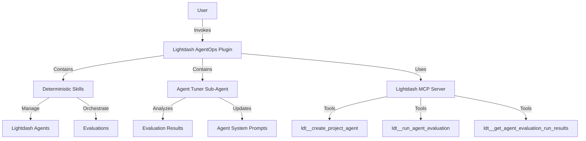

# 16. Introduce Lightdash AgentOps Plugin for AI Agent Management and Tuning

Date: 2026-02-27

## Status

Accepted

## Context

Lightdash has introduced AI Agent capabilities, which require robust management, evaluation, and tuning. Currently, our plugins focus on analytics, content administration, and development, but lack a dedicated space for AgentOps/LLMOps.

We need a way to:

1. Manage the lifecycle of Lightdash agents (CRUD).
2. Orchestrate evaluations (AgentOps) to ensure agent quality.
3. Inspect and debug agent threads and memory.
4. Autonomously tune agents based on evaluation results (self-improvement loop).

## Decision

We will create a new plugin, `lightdash-agentops`, dedicated to these tasks. This plugin will follow the "Eval-Driven Development" philosophy and integrate with the existing Lightdash MCP server.

### 1. Hybrid Architecture (Skills + Sub-Agent)

The plugin will consist of deterministic skills for workflow management and an autonomous sub-agent for intelligent tuning.

- **Skills**:
  - `manage-lightdash-agents`: CRUD operations for project agents.
  - `run-lightdash-evals`: Orchestration of evaluation runs and test case management.
  - `debug-agent-threads`: Inspection of thread history and memory.
- **Sub-Agent**:
  - `agent-tuner`: An autonomous agent that reads evaluation results and updates agent configurations (system prompts, parameters) to improve performance.

### 2. Safety Enforcement

Following ADR-0005, we will implement deterministic safety hooks to guard destructive operations such as agent deletion and evaluation deletion.

### 3. Selective Tool Exposure

Following ADR-0015, the plugin will only be exposed to the subset of Lightdash MCP tools required for AgentOps.

### 4. Architecture

## Consequences

- **Positive**:
  - **Centralized AgentOps**: Provides a single place for all agent-related management and tuning.
  - **Automated Improvement**: Enables autonomous tuning of agents based on real evaluation data.
  - **Safety**: Ensures destructive operations are gated by deterministic hooks.
  - **Eval-Driven**: Enforces the practice of testing before and after agent updates.
- **Negative**:
  - **Complexity**: Introduces a more complex hybrid component model (Skills + Sub-Agents).
  - **API Costs**: Autonomous tuning loops may incur additional LLM costs if not carefully monitored.
